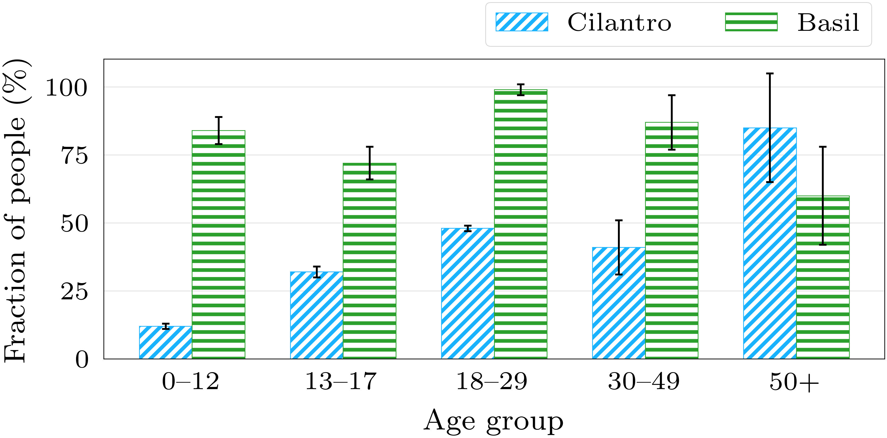
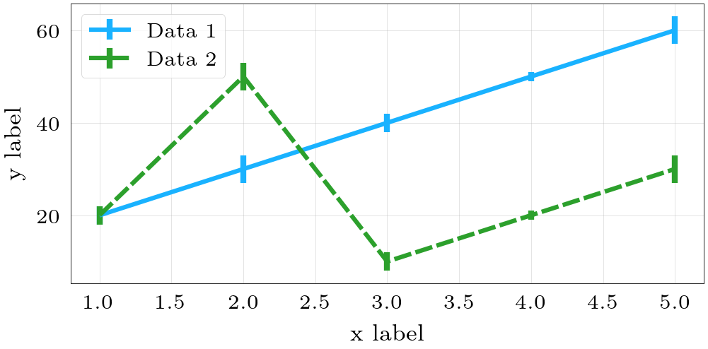

# Plot Style

## Setup

The script requires LaTeX to be installed, it uses it to render the text in the figures as well as to adjust the figure and font sizes based on the target document style.

### Ubuntu (or other Debian-based distro)

Use the following command to install LaTeX:

```bash
sudo apt update
sudo apt install texlive-base texlive-latex-recommended texlive-fonts-recommended texlive-publishers texlive-latex-extra
```

Install the python dependencies using pip:

```bash
pip3 install -r requirements.txt
```

### macOS

Install mactex and other dependencies using [homebrew]([https://brew.sh/):

```bash
brew install --cask mactex
brew install libpng freetype pkg-config fontconfig
```

Install the python dependencies using pip:

```bash
pip3 install -r requirements.txt
```

## Example

Check `plot.py` for an example on how to produce the following line and bar plots:




